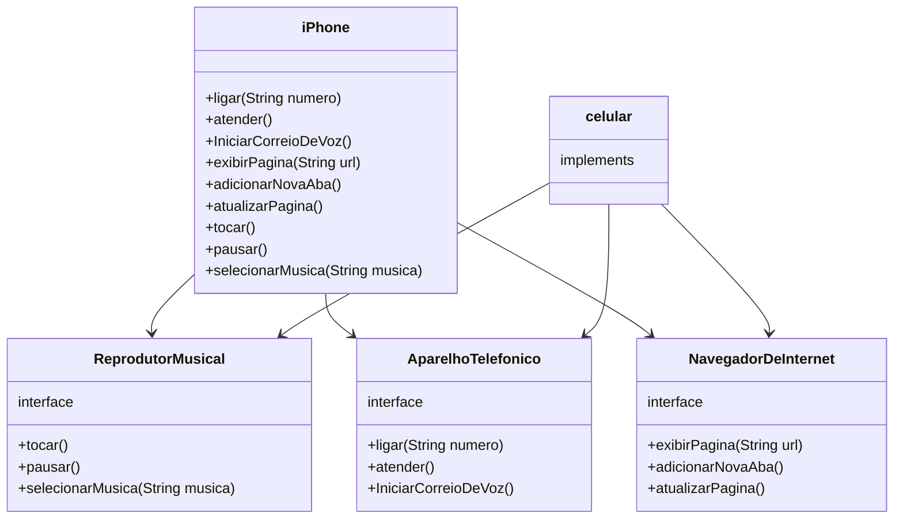

### Diagrama UML iPhone 

```mermaid
classDiagram
    class ReprodutorMusical {
        interface
        +tocar()
        +pausar()
        +selecionarMusica(String musica)
    }
     class NavegadorDeInternet {
        interface
        +exibirPagina(String url)
        +adicionarNovaAba()
        +atualizarPagina()
    }
    class AparelhoTelefonico {
        interface
        +ligar(String numero)
        +atender()
        +IniciarCorreioDeVoz()
    }
    class iPhone {
      +ligar(String numero)
        +atender()
        +IniciarCorreioDeVoz()
        +exibirPagina(String url)
        +adicionarNovaAba()
        +atualizarPagina()
        +tocar()
        +pausar()
        +selecionarMusica(String musica)
    }
      class celular {
         implements
    }
    iPhone --> ReprodutorMusical
    iPhone --> AparelhoTelefonico
    iPhone --> NavegadorDeInternet
    celular --> AparelhoTelefonico
    celular --> NavegadorDeInternet
    celular --> ReprodutorMusical
```
