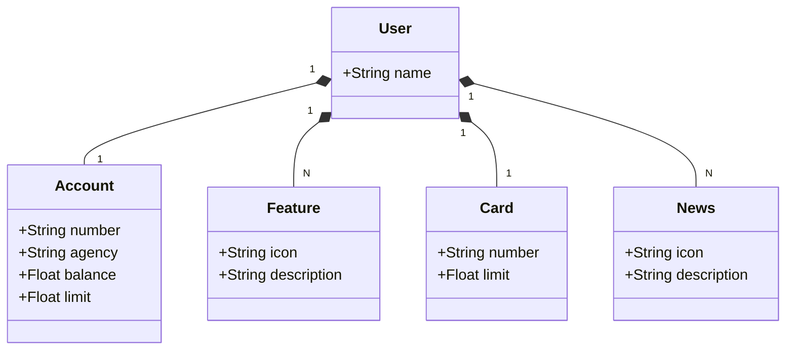

# Projeto API REST na Nuvem Usando Spring Boot 3, Java 17 e Railway

## Diagrama de classe

```mermaid
classDiagram
    class User {
        +String name
    }
    
    class Account {
        +String number
        +String agency
        +Float balance
        +Float limit
    }

    class Feature {
        +String icon
        +String description
    }

    class Card {
        +String number
        +Float limit
    }

    class News {
        +String icon
        +String description
    }

    User "1" *--  "1" Account
    User "1" *--  "N" Feature
    User "1" *--  "1" Card
    User "1" *--  "N" News
```
